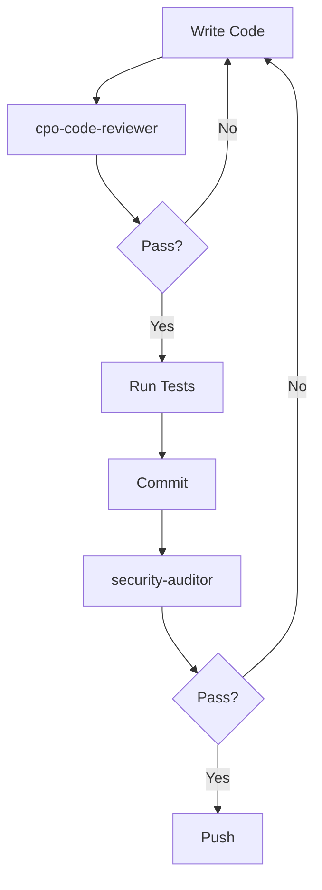

# 🤖 Claude Code Agents Configuration

## Overview

This document defines specialized Claude Code agents for the Armora CPO mobile app development. These agents help automate specific tasks and maintain consistency throughout the development process.

---

## Available Agents

### 1. **cpo-code-reviewer**
**Purpose:** Review all code for security, performance, and SIA compliance

**Triggers:**
- After completing any screen implementation
- Before committing code changes
- When adding security-sensitive features

**Review Checklist:**
- ✅ Mobile-first responsive design (320px+)
- ✅ Touch targets minimum 44px
- ✅ Security best practices (encryption, data handling)
- ✅ Performance optimization (lazy loading, memoization)
- ✅ Accessibility (WCAG 2.1 AA)
- ✅ SIA compliance terminology
- ✅ Error handling and validation
- ✅ TypeScript type safety
- ✅ Code documentation

**Example Usage:**
```bash
# After implementing authentication flow
/agents cpo-code-reviewer src/screens/Auth/
```

---

### 2. **sia-compliance-validator**
**Purpose:** Validate all SIA-related terminology and compliance features

**Triggers:**
- When adding compliance-related screens
- When implementing license verification
- Before deployment

**Validation Rules:**
- ✅ Correct SIA terminology (CPO, not "driver")
- ✅ Assignments (not "rides" or "trips")
- ✅ Principals (not "passengers")
- ✅ License validation logic
- ✅ Expiry date tracking
- ✅ Compliance scoring algorithm

**Example Usage:**
```bash
/agents sia-compliance-validator src/screens/Compliance/
```

---

### 3. **mobile-optimizer**
**Purpose:** Optimize code for mobile performance and battery efficiency

**Triggers:**
- After implementing any feature with GPS
- When adding real-time updates
- Before production deployment

**Optimization Checks:**
- ✅ Lazy loading components
- ✅ Image compression and WebP format
- ✅ Virtual scrolling for lists
- ✅ Debounced inputs
- ✅ Throttled GPS updates
- ✅ Efficient re-renders (React.memo)
- ✅ Battery-friendly background tasks

**Example Usage:**
```bash
/agents mobile-optimizer src/
```

---

### 4. **security-auditor**
**Purpose:** Audit security features and data protection

**Triggers:**
- When implementing authentication
- When handling payment data
- When adding SOS/emergency features
- Before production deployment

**Security Checklist:**
- ✅ Encrypted data storage
- ✅ Secure API communication (HTTPS)
- ✅ PCI DSS compliance (payments)
- ✅ GDPR compliance (data handling)
- ✅ Input validation and sanitization
- ✅ XSS and CSRF protection
- ✅ Secure session management
- ✅ Biometric authentication implementation

**Example Usage:**
```bash
/agents security-auditor src/services/
```

---

### 5. **api-integration-tester**
**Purpose:** Test all API endpoint integrations with client app

**Triggers:**
- After implementing any API service
- When adding new endpoints
- Before merging to main branch

**Test Coverage:**
- ✅ Request/response structure matches schema
- ✅ Error handling for network failures
- ✅ Loading states implemented
- ✅ Retry logic for failed requests
- ✅ Authentication headers included
- ✅ Data transformation correct
- ✅ Mock data for development

**Example Usage:**
```bash
/agents api-integration-tester src/services/api/
```

---

### 6. **accessibility-checker**
**Purpose:** Ensure WCAG 2.1 AA compliance

**Triggers:**
- After implementing any UI component
- Before screen completion
- Before production deployment

**Accessibility Requirements:**
- ✅ Semantic HTML elements
- ✅ ARIA labels and roles
- ✅ Keyboard navigation support
- ✅ Screen reader compatibility
- ✅ Color contrast ratios (4.5:1 text, 3:1 UI)
- ✅ Focus indicators visible
- ✅ Error messages descriptive

**Example Usage:**
```bash
/agents accessibility-checker src/components/
```

---

### 7. **pwa-validator**
**Purpose:** Validate PWA configuration and offline capabilities

**Triggers:**
- After modifying service worker
- When updating manifest.json
- Before deployment

**PWA Checklist:**
- ✅ manifest.json valid
- ✅ Service worker registration
- ✅ Offline functionality working
- ✅ Install prompts configured
- ✅ App icons all sizes present
- ✅ Splash screens configured
- ✅ Cache strategy optimal

**Example Usage:**
```bash
/agents pwa-validator public/
```

---

### 8. **supabase-schema-validator**
**Purpose:** Validate database schema and queries

**Triggers:**
- When creating new tables
- When modifying queries
- Before migration

**Validation:**
- ✅ Schema matches client app
- ✅ Foreign keys defined correctly
- ✅ Indexes on frequently queried columns
- ✅ RLS (Row Level Security) policies
- ✅ Query optimization
- ✅ No N+1 query problems

**Example Usage:**
```bash
/agents supabase-schema-validator docs/database-schema.sql
```

---

### 9. **real-time-tester**
**Purpose:** Test real-time features (assignments, messaging, location)

**Triggers:**
- After implementing WebSocket connections
- When adding push notifications
- When implementing live updates

**Test Scenarios:**
- ✅ New assignment notifications
- ✅ Message delivery and read receipts
- ✅ Location updates to dispatch
- ✅ Reconnection after network loss
- ✅ Offline queue and sync
- ✅ Push notification delivery

**Example Usage:**
```bash
/agents real-time-tester src/services/realtime/
```

---

### 10. **performance-profiler**
**Purpose:** Profile app performance and identify bottlenecks

**Triggers:**
- After major feature completion
- When app feels slow
- Before production deployment

**Profiling Metrics:**
- ✅ First Contentful Paint (FCP) < 1.8s
- ✅ Largest Contentful Paint (LCP) < 2.5s
- ✅ Time to Interactive (TTI) < 3.8s
- ✅ Total Blocking Time (TBT) < 200ms
- ✅ Cumulative Layout Shift (CLS) < 0.1
- ✅ Bundle size analysis
- ✅ Memory usage

**Example Usage:**
```bash
/agents performance-profiler
```

---

## Agent Workflow

### **Standard Development Flow:**



### **Pre-Deployment Checklist:**

```bash
# Run all validators before deployment
/agents cpo-code-reviewer src/
/agents sia-compliance-validator src/
/agents mobile-optimizer src/
/agents security-auditor src/
/agents accessibility-checker src/
/agents pwa-validator public/
/agents performance-profiler
```

---

## Custom Agent Commands

### **Create Custom Agent:**

```typescript
// .claude/agents/custom-agent.ts
export const customAgent = {
  name: "custom-agent",
  description: "Your custom agent description",
  triggers: ["when to run this agent"],
  rules: [
    "Rule 1",
    "Rule 2",
    "Rule 3"
  ],
  execute: async (files: string[]) => {
    // Agent logic here
  }
};
```

### **Run Custom Agent:**

```bash
/agents custom-agent path/to/files/
```

---

## Agent Configuration Files

### **.claude/config.json**

```json
{
  "agents": {
    "cpo-code-reviewer": {
      "enabled": true,
      "autoRun": false,
      "filePatterns": ["**/*.tsx", "**/*.ts"]
    },
    "sia-compliance-validator": {
      "enabled": true,
      "autoRun": false,
      "filePatterns": ["**/Compliance/**", "**/Profile/**"]
    },
    "mobile-optimizer": {
      "enabled": true,
      "autoRun": false,
      "filePatterns": ["**/*.tsx", "**/*.css"]
    },
    "security-auditor": {
      "enabled": true,
      "autoRun": true,
      "filePatterns": ["**/services/**", "**/Auth/**"]
    },
    "api-integration-tester": {
      "enabled": true,
      "autoRun": false,
      "filePatterns": ["**/services/api/**"]
    }
  }
}
```

---

## Best Practices

1. **Run agents frequently** - Don't wait until the end
2. **Fix issues immediately** - Don't accumulate technical debt
3. **Use auto-run for critical agents** - Security, accessibility
4. **Create project-specific agents** - For recurring patterns
5. **Document agent results** - Track improvements over time

---

## Agent Outputs

### **Example: cpo-code-reviewer Output**

```
🔍 CPO Code Review Results
━━━━━━━━━━━━━━━━━━━━━━━━━━━━━━━━━━━━━━━━━━━━

File: src/screens/Auth/LoginScreen.tsx
━━━━━━━━━━━━━━━━━━━━━━━━━━━━━━━━━━━━━━━━━━━━

✅ Mobile responsive (320px+)
✅ Touch targets 44px+
✅ TypeScript types defined
⚠️  Missing error handling for network failures
❌ Password input not using secure input type

Suggested fixes:
1. Add try/catch around login API call
2. Change <input type="text"> to <input type="password">

Performance:
✅ Using React.memo for optimization
✅ Lazy loaded
⚠️  Consider debouncing email validation

Security:
✅ Credentials encrypted
❌ Missing rate limiting for login attempts

Overall Score: 7/10
━━━━━━━━━━━━━━━━━━━━━━━━━━━━━━━━━━━━━━━━━━━━
```

---

## Integration with CI/CD

### **GitHub Actions Workflow:**

```yaml
name: Agent Validation

on: [push, pull_request]

jobs:
  validate:
    runs-on: ubuntu-latest
    steps:
      - uses: actions/checkout@v3
      - name: Run CPO Code Reviewer
        run: /agents cpo-code-reviewer src/
      - name: Run Security Auditor
        run: /agents security-auditor src/
      - name: Run SIA Compliance Validator
        run: /agents sia-compliance-validator src/
```

---

## Agent Metrics Dashboard

Track agent performance over time:

```
┌─────────────────────────────────────────────────┐
│          Agent Performance Metrics              │
├─────────────────────────────────────────────────┤
│ Agent                    | Runs | Pass | Fail   │
├──────────────────────────┼──────┼──────┼────────┤
│ cpo-code-reviewer        │  45  │  42  │   3    │
│ sia-compliance-validator │  12  │  12  │   0    │
│ mobile-optimizer         │  20  │  18  │   2    │
│ security-auditor         │  30  │  28  │   2    │
│ accessibility-checker    │  35  │  33  │   2    │
└─────────────────────────────────────────────────┘
```

---

## Support

For issues with agents:
1. Check agent configuration in `.claude/config.json`
2. Review agent logs in `.claude/logs/`
3. Create issue in repo with agent output
4. Contact Claude Code support

---

**Remember:** Agents are your assistants, not replacements for careful development. Use them to catch issues early and maintain consistent quality! 🤖✨
